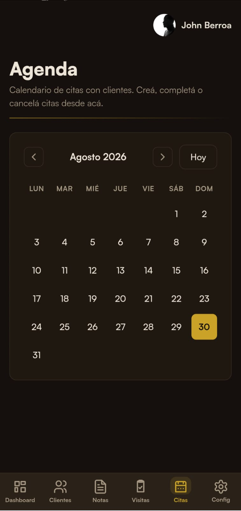
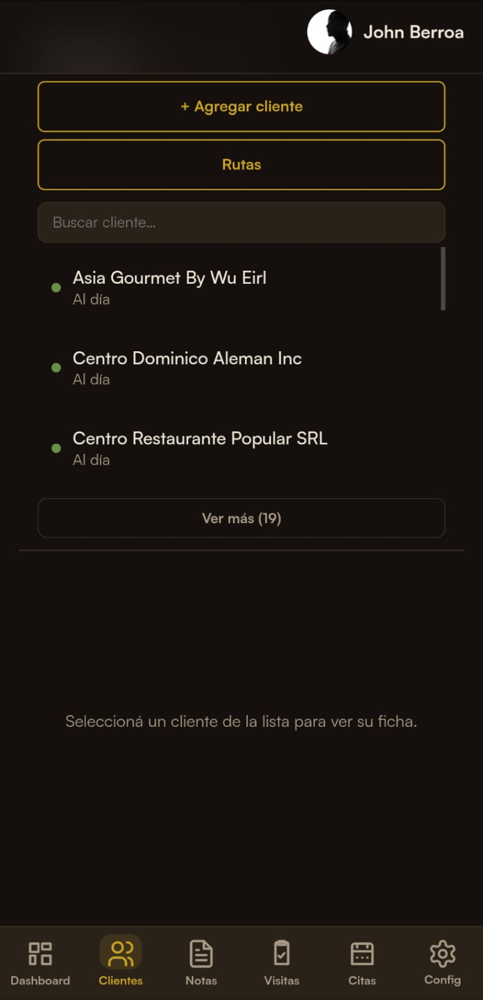
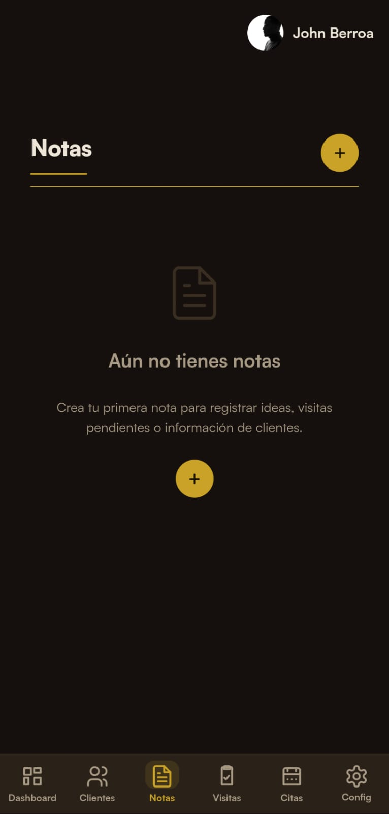
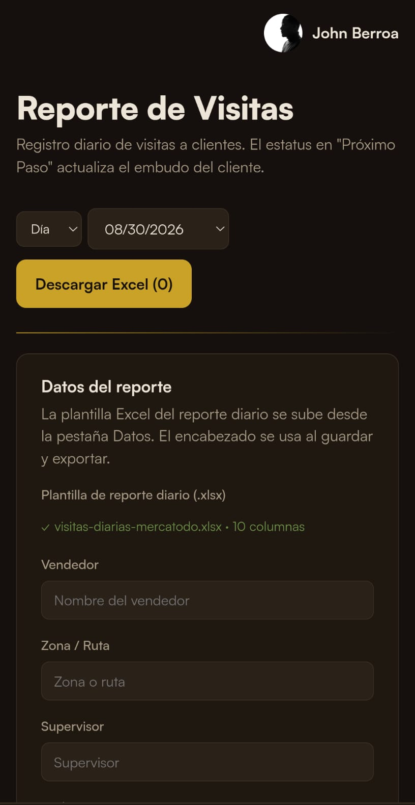

Comencé a trabajar para una empresa de distribución en el área de venta, es una experiencia nueva para mi un reto, algo personal, además necesito recuperarme de malas decisiones.

Los primeros días son como todos incómodos la necesidad de aprender rápido toda esa información de golpe, el ir visitando clientes activos algunos olvidados y otros en frío decidí  anotar todo ya que tengo que hacer un reporte, pero entre llevar mis notas a excel y llevar las cuentas por cobrar y citas que anotar en calendario, pensé en un CRM (Customer Relationship Management o gestión de relaciones con los clientes).

Buscando me di cuenta que la mayoría de  los CRM están  enfocados para empresas y equipos grandes son complicados y cuestan mucho para lo que necesito.

Asi que decidi crear una herramienta para mi para mi flujo de trabajo, como proyecto y quedo hermoso y jugoso. Se llama **ZOLA** - un CRM practico con calendario, un bloc de notas, Dashboard, seguimiento de ventas y clientes, un agente que convierte las notas en excel y se adapta a la plantilla que le coloques, puedo guardar mi catalogo de productos Tiene  una herramienta de IA que  lee una imagen de un menú desarrolla las preparaciones de los platos compara los ingredientes con el catálogo y prepara un resumen en un documento  que puedes usar para venderle al cliente y así llegar preparado.

Estoy enamorado , me ayuda a tener un control y un flujo mas rapido, todavia estoy en fase de prueba, este mes empezare a usarlo.
